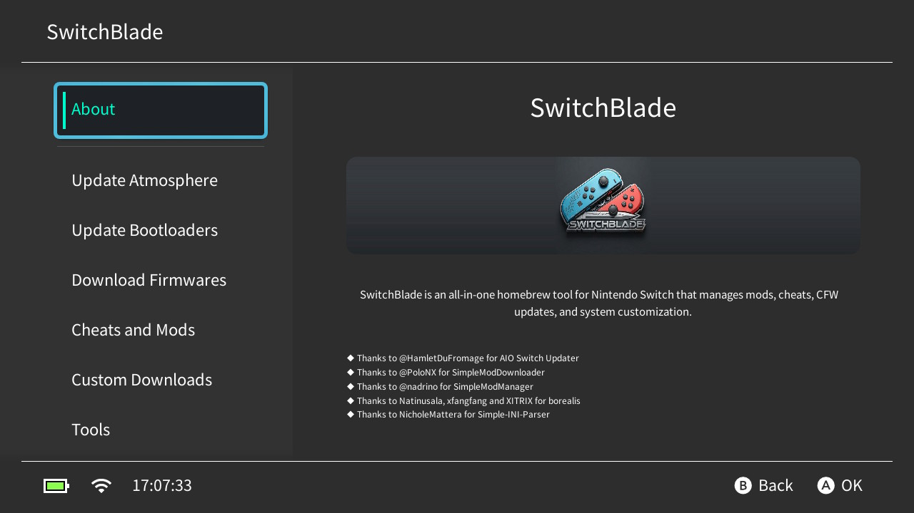
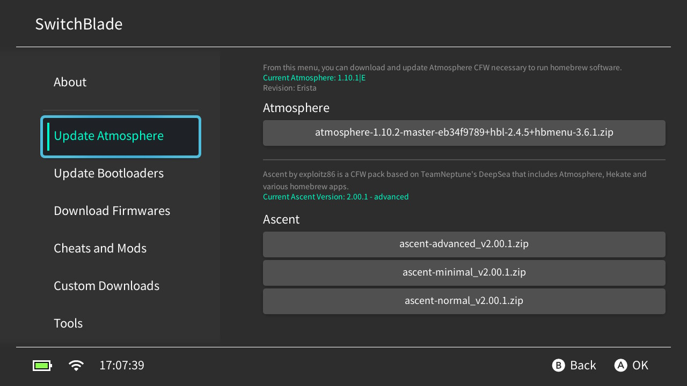
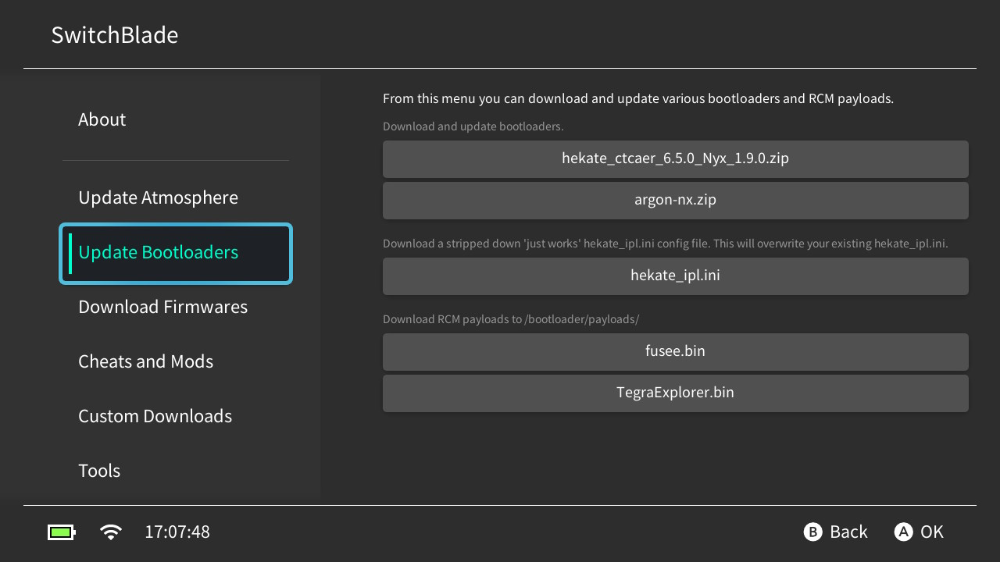
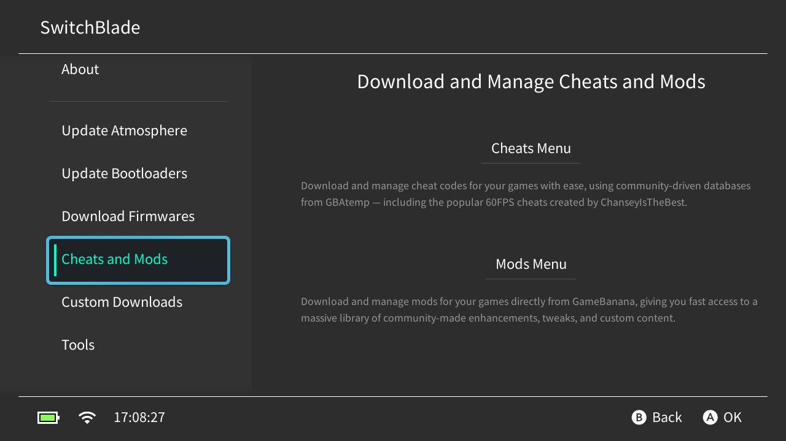
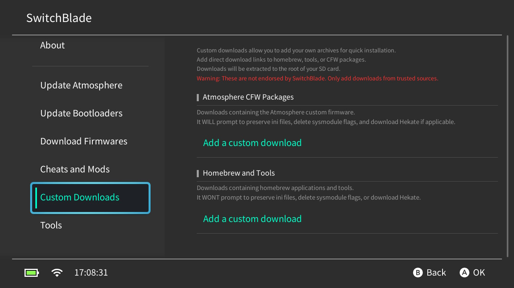

# SwitchBlade

<p align="center">
  <br>
</p>

<p align="center">
  
  <a href="https://github.com/exploitz86/SwitchBlade/actions">
    
  </a>
  
  
</p>

<p align="center">
  <a href="https://ko-fi.com/exploitz">
    
  </a>
</p>

---

An all-in-one Nintendo Switch homebrew tool that manages mods, cheats, CFW updates, and system customization. Built on top of SimpleModDownloader and AIO-Switch-Updater with enhanced features and reliability.

Works on **unpatched** (Erista) and **patched** (v2/Mariko) Switches.

## How to install
Copy the `SwitchBlade/` directory to `/switch/` on your SD card.

## Features

### ⬦ Mod Manager & Browser
- **Browse and Download Mods**: Search and download mods directly from GameBanana for your games with fast access to a massive library of community-made enhancements, tweaks, and custom content.
- **Manage Installed Mods**: Enable/disable mods, view mod details, and uninstall mods with an intuitive interface.
- **Mod Presets**: Create, edit, and apply mod presets to quickly switch between different mod configurations.
- **Automatic Mod Status Checking**: The app tracks which mods are active, inactive, or partially applied.
- **Game-Specific Mod Management**: Mods are automatically organized by game title ID for easy management.
- **Super Smash Bros. Ultimate Support**: Special handling for ARCropolis mods with automatic extraction to `sdmc:/ultimate/mods/`.

### ⬦ Cheat Code Management
- Download and extract daily-updated cheat codes from the GBAtemp.net database. The program will only extract cheat codes for the games you own.
- Download cheat sheets from [Cheat Slips](https://www.cheatslips.com/).
- Download individual cheat codes from the GBAtemp.net database.
- Includes popular 60FPS and graphics enhancement cheats created by ChanseyIsTheBest.
- View and manage installed cheats with an easy-to-use interface.
- Exclude specific titles from bulk cheat downloads.
- Delete orphaned cheats (for games no longer installed).

### ⬦ Update CFW
- Update Atmosphère Switch Custom Firmware. SwitchBlade uses a custom RCM payload to finalize the install as it can't be performed while HOS is running.
- Update Ascent CFW pack (based on TeamNeptune's DeepSea).
- If you would like to preserve additional files or directories, write their path (one line each) in `/config/SwitchBlade/preserve.txt` and they won't be overwritten when updating.

### ⬦ Update Bootloaders & Payloads
- Download and update Hekate, as well as a selection of RCM payloads.
- Download payloads directly to `/bootloader/payloads/`.
- Update hekate_ipl.ini configuration file.

### ⬦ Custom Downloads
- Custom download URLs can be configured in `/config/SwitchBlade/custom_packs.json`. Once added, they will show in the `Custom Downloads` menu.
- Support for both Atmosphère CFW packages and general homebrew/tools downloads.
- Atmosphere packages will prompt for ini file preservation, sysmodule flag deletion, and Hekate download.

### ⬦ Download Firmwares
- Download firmware files from [THZoria/NX_Firmware](https://github.com/THZoria/NX_Firmware) to `/firmware/` that can then be installed using Daybreak.

## Extras (in the `Tools` tab)
- **Inject Payload**: Reboot to a specific payload from `/payloads/` or `/bootloader/payloads/`.
- **System Options**: Power off or reboot the console.
- **Change Joy-Con Colors**: Customize the software color scheme of Joy-Cons. Additional color profiles can be saved in `/config/SwitchBlade/jc_profiles.json`.
- **Change Pro Controller Colors**: Customize the software color scheme of Pro Controllers. Additional color profiles can be saved in `/config/SwitchBlade/pc_profiles.json`.
- **Check for Missing Updates**: Find games with available updates.
- **Edit Internet Settings**: Configure DNS, IP address, MTU, and other network settings. Add custom configs to `/config/SwitchBlade/internet.json`.
- **Clean up Atmosphere Reports**: Delete crash reports, fatal reports, fatal errors, and erpt reports.
- **App Language**: Change the application language (currently supports English and German).

## Screenshots
<details><summary>Expand to view the screenshots</summary>







</details>

## Build

<details><summary>Expand to view the build instructions</summary>

### Requirements

- [devkitPro](https://devkitpro.org/wiki/Getting_Started)
- [Xmake](https://xmake.io/#/)

### Install Dependencies

```bash
sudo (dkp-)pacman -Sy
sudo (dkp-)pacman -S switch-curl \
                      switch-zlib \
                      switch-glfw \
                      switch-mesa \
                      switch-glm \
                      switch-libarchive \
                      switch-mbedtls \
                      devkitarm-rules
```

### Clone and Build

```bash
git clone --recursive https://github.com/exploitz86/SwitchBlade
cd SwitchBlade
xmake f --yes -p cross -m release -a aarch64 --toolchain=devkita64
xmake
```

</details>

## Contribute

PRs and suggestions are encouraged! If you wish to help with localization, you can translate the files in `resources/i18n/`. The app currently supports English and German, with community translations welcome for other languages.

## Disclaimer
I do not own, host, nor distribute any of the files that can be downloaded with this homebrew tool. At the owner's request, I will immediately remove the ability to download any problematic file.

## Credits and Special Thanks

- **[HamletDuFromage](https://github.com/HamletDuFromage)** for AIO-Switch-Updater, which served as the foundation for CFW update functionality.
- **[PoloNX](https://github.com/PoloNX)** for SimpleModDownloader, the original mod downloading and management system.
- **[nadrino](https://github.com/nadrino)** for SimpleModManager and the modified Borealis library.
- **[Natinusala](https://github.com/natinusala)**, **[xfangfang](https://github.com/xfangfang)**, and **[XITRIX](https://github.com/XITRIX)** for [borealis](https://github.com/xfangfang/borealis), the UI framework.
- **[NicholeMattera](https://github.com/NicholeMattera)** for [Simple-INI-Parser](https://github.com/NicholeMattera/Simple-INI-Parser).
- **[GameBanana](https://gamebanana.com/)** for their API enabling mod downloads.
- **[ChanseyIsTheBest](https://github.com/ChanseyIsTheBest)** for the popular 60FPS and graphics enhancement cheats.
- **Iliak** for [Cheat Slips](https://www.cheatslips.com/).
- **[Team Neptune](https://github.com/Team-Neptune)** for RCM payload code.

### Like the app? Consider supporting development!
<p align="center">
  <a href="https://ko-fi.com/exploitz">
    
  </a>
</p>


